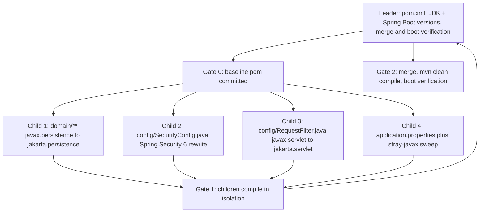

# Migration Playbook — JDK + Spring Boot Major Upgrades

## 1. Purpose & scope

This is a **reusable runbook** for major platform migrations of this codebase
(`com.userfront` / artifact `userFront`), not a record of a single upgrade. Use it
whenever the project moves across a major boundary that touches the whole tree at once:

- a JDK major upgrade (e.g. `1.8` → `17` → `21`);
- a Spring Boot major upgrade (e.g. `2.x` → `3.x`), which drags along Spring Security 6,
  Hibernate 6 and the `javax.*` → `jakarta.*` namespace change;
- any upgrade that renames dependency coordinates or removes deprecated configuration
  base classes.

The work is split between **one leader session** (build/toolchain owner) and **four child
sessions** (source owners) so that the mechanical, file-local rewrites happen in parallel
while the build definition stays under single ownership. The playbook is written for
this repository's actual layout: a single Maven module, `src/main/java/com/userfront/**`,
a single `src/main/resources/application.properties`, **no `src/test/` directory**, and a
MySQL datasource pointed at `localhost:3306`.

Out of scope: functional refactors, new features, and the pre-existing security defects
listed in section 7 — those are carried forward deliberately, not fixed in a migration.

## 2. Pre-migration assessment checklist

Run these checks first and record the answers; they determine which recipes in section 6
apply and how the child sessions are scoped. The "current state" column reflects the
codebase as of this document.

| # | Check | How to verify | Current state |
|---|-------|---------------|---------------|
| 1 | `<java.version>` in `pom.xml` | `grep -n "java.version" pom.xml` | `1.8` |
| 2 | `spring-boot-starter-parent` version | `grep -n -A2 "spring-boot-starter-parent" pom.xml` | `2.0.0.M7` (a milestone release, not GA) |
| 3 | `javax.*` usage | `grep -r "import javax\." src/` | 10 files: `config/RequestFilter.java` (`javax.servlet.*`) and 9 files under `domain/` + `domain/security/` (`javax.persistence.*`) |
| 4 | `WebSecurityConfigurerAdapter` present | `grep -rn "WebSecurityConfigurerAdapter" src/` | Yes — `config/SecurityConfig.java` extends it |
| 5 | `src/test/` present | `ls src/test` | **Absent** — no unit or integration tests exist |
| 6 | Custom `hibernate.dialect` | `grep -n "hibernate.dialect" src/main/resources/application.properties` | `org.hibernate.dialect.MySQL5Dialect` |
| 7 | Renamed dependency coordinates | `grep -n -A2 "<artifactId>mysql-connector" pom.xml` | `mysql:mysql-connector-java` (version managed by the parent) |
| 8 | Non-central repositories | `grep -n "repo.spring.io" pom.xml` | Spring `snapshot` + `milestone` repos declared in both `<repositories>` and `<pluginRepositories>` |

Two consequences worth flagging before starting:

- Check 5 means there is **no automated regression signal**. The boot smoke test in
  Gate 2 is the only gate that proves anything (see section 8).
- Check 2 means the baseline is a milestone build; pinning a GA parent version is part of
  the leader's Gate 0 work, and it is what makes the milestone repositories removable.

## 3. Orchestration model

One leader plus four children working in parallel.

**Invariant — disjoint file ownership.** Every file in the repository is owned by exactly
one session for the duration of the migration. A child never edits a file it does not own,
never edits `pom.xml`, and never "helpfully" fixes a compile error located in another
child's file — it reports it to the leader instead. This is what makes the parallel phase
mergeable without conflicts.



## 4. File ownership map

| Owner | Owns | Scope of change |
|-------|------|-----------------|
| Leader | `pom.xml` | `<java.version>`, `spring-boot-starter-parent` version, dependency coordinate renames, removal of the Spring milestone/snapshot `<repositories>` and `<pluginRepositories>` blocks. Also owns the merge and both build gates. |
| Child 1 | `src/main/java/com/userfront/domain/**` | `javax.persistence` → `jakarta.persistence` across the 7 top-level entities (`Appointment`, `PrimaryAccount`, `PrimaryTransaction`, `Recipient`, `SavingsAccount`, `SavingsTransaction`, `User`) and `domain/security/` (`Role`, `UserRole`; `Authority` has no `javax` imports). Includes wildcard imports such as `javax.persistence.*`. |
| Child 2 | `src/main/java/com/userfront/config/SecurityConfig.java` | Spring Security 6 rewrite: drop `WebSecurityConfigurerAdapter`, publish a `SecurityFilterChain` bean, move to the lambda DSL with `requestMatchers`, and replace `configureGlobal` with bean-based auth wiring. Keeps `PUBLIC_MATCHERS` and the `BCryptPasswordEncoder` bean behaviour as-is. |
| Child 3 | `src/main/java/com/userfront/config/RequestFilter.java` | `javax.servlet` → `jakarta.servlet` (`Filter`, `FilterChain`, `FilterConfig`, `ServletRequest`, `ServletResponse`, `http.HttpServletRequest`, `http.HttpServletResponse`). Header logic and `@Order(Ordered.HIGHEST_PRECEDENCE)` unchanged. |
| Child 4 | `src/main/resources/application.properties` **plus** a stray-`javax` sweep of `controller/`, `service/`, `dao/`, `resource/` | Hibernate dialect update; then `grep -rn "javax\." src/main/java/com/userfront/{controller,service,dao,resource}` and convert anything found. This sweep is expected to come back empty in the current state — it exists so that later additions (`javax.validation`, `javax.annotation`, `javax.servlet` in controllers) are not missed. |

Unowned and untouched: `src/main/resources/templates/**`, `src/main/resources/static/**`,
`mvnw`, `mvnw.cmd`, `.mvn/**`, `README.md`.

## 5. Phase gates

### Gate 0 — leader baseline pom committed

The leader alone, before any child starts:

1. Bump `<java.version>` and the `spring-boot-starter-parent` version to the target GA release.
2. Apply the dependency coordinate renames and remove the milestone/snapshot repositories.
3. Commit `pom.xml` on the migration branch and push.

Gate 0 passes when the new `pom.xml` is committed and its dependencies resolve
(`mvn -q dependency:resolve`). Compilation is *expected to fail* at this point — the
sources are still on the old namespace. Children must branch from this commit so they all
compile against the same dependency set.

### Gate 1 — children compile in isolation, no cross-file edits

Each child, on its own branch:

1. Apply only the recipes for the files it owns.
2. Verify: `mvn clean compile` and confirm that **every remaining error is located in a
   file owned by another session**. Zero errors in owned files is the pass condition.
3. Verify ownership discipline: `git diff --name-only` must list only owned paths.
4. Report remaining foreign errors to the leader rather than fixing them.

Gate 1 passes when all four children have reported and no child's diff touches a file it
does not own.

### Gate 2 — leader merges, compiles, boots

The leader merges the four child branches (the disjoint-ownership invariant should make
this conflict-free apart from `pom.xml`, which only the leader touched), then:

1. `mvn clean compile` — must succeed with zero errors.
2. `mvn spring-boot:run` — boot verification against a **local MySQL** instance reachable
   at the `spring.datasource.url` in `application.properties`
   (`jdbc:mysql://localhost:3306/OnlineBankingSystem`; the schema must exist, and
   `ddl-auto=update` creates the tables).
3. Confirm in the startup log: the datasource connects, Hibernate emits the entity DDL
   without dialect warnings, the security filter chain is built, and Tomcat reaches
   "Started" without a failed `ApplicationContext`.
4. Sanity-check the running app: `GET /` (public) returns 200 and `GET /userFront`
   redirects to the login page (authenticated), proving the rewritten filter chain still
   enforces `PUBLIC_MATCHERS`.

Gate 2 is the release gate. Since there is no `src/test/`, a failure here is the only
signal the migration is wrong — do not merge to `master` without it.

## 6. Reusable transformation recipes

### 6.1 `javax.*` → `jakarta.*` namespace maps

Persistence (Child 1) — mechanical prefix swap, class names unchanged:

| Before | After |
|--------|-------|
| `javax.persistence.*` | `jakarta.persistence.*` |
| `javax.persistence.Entity` / `Id` / `GeneratedValue` / `GenerationType` | `jakarta.persistence.…` (same simple names) |
| `javax.persistence.Column` / `JoinColumn` / `CascadeType` / `FetchType` | `jakarta.persistence.…` |
| `javax.persistence.OneToOne` / `OneToMany` / `ManyToOne` | `jakarta.persistence.…` |

Servlet (Child 3):

| Before | After |
|--------|-------|
| `javax.servlet.Filter` / `FilterChain` / `FilterConfig` | `jakarta.servlet.…` |
| `javax.servlet.ServletRequest` / `ServletResponse` | `jakarta.servlet.…` |
| `javax.servlet.http.HttpServletRequest` / `HttpServletResponse` | `jakarta.servlet.http.…` |

Sweep (Child 4), for code added after this document was written:

| Before | After |
|--------|-------|
| `javax.validation.*` | `jakarta.validation.*` |
| `javax.annotation.*` | `jakarta.annotation.*` |
| `javax.transaction.Transactional` | `jakarta.transaction.Transactional` |

Bulk form, applied only to owned paths:

```bash
grep -rl "javax\.\(persistence\|servlet\|validation\|annotation\|transaction\)" <owned-path> \
  | xargs sed -i 's/javax\.\(persistence\|servlet\|validation\|annotation\|transaction\)/jakarta.\1/g'
```

Always re-run `grep -r "import javax\." src/` afterwards: `sed` will not catch
fully-qualified references written inline in method bodies.

### 6.2 Spring Security 6 rewrite (Child 2)

`WebSecurityConfigurerAdapter` is removed in Spring Security 6. Replace the
`extends WebSecurityConfigurerAdapter` class with a plain `@Configuration`
`@EnableWebSecurity` class exposing beans:

- **`SecurityFilterChain` bean** replaces `protected void configure(HttpSecurity http)`.
  The method takes `HttpSecurity` as a parameter and returns `http.build()`.
- **`requestMatchers` + lambda DSL** replaces `authorizeRequests().antMatchers(...)`:
  `authorizeHttpRequests(auth -> auth.requestMatchers(PUBLIC_MATCHERS).permitAll()
  .anyRequest().authenticated())`. The `.and()` chaining style is replaced by one lambda
  per concern (`csrf`, `cors`, `formLogin`, `logout`, `rememberMe`).
- **Bean-based auth wiring** replaces the `@Autowired configureGlobal(AuthenticationManagerBuilder)`
  method: publish a `DaoAuthenticationProvider` (or `AuthenticationManager`) bean wired to
  the existing `UserSecurityService` and the `BCryptPasswordEncoder` bean, and let Spring
  pick it up from the context.
- `@EnableGlobalMethodSecurity(prePostEnabled = true)` is deprecated; use
  `@EnableMethodSecurity` (pre/post support is on by default).
- `.csrf().disable()` / `.cors().disable()` become `.csrf(csrf -> csrf.disable())` /
  `.cors(cors -> cors.disable())`. Preserve the existing behaviour here rather than
  changing it (see section 7).

Preserve, unchanged: the `PUBLIC_MATCHERS` array contents, the login/logout URLs
(`/index`, `/index?error`, `/userFront`, `/index?logout`), the `remember-me` cookie
deletion, and the `AntPathRequestMatcher("/logout")` logout matcher.

### 6.3 Hibernate dialect

In `src/main/resources/application.properties`:

```properties
# before
spring.jpa.properties.hibernate.dialect = org.hibernate.dialect.MySQL5Dialect
# after
spring.jpa.properties.hibernate.dialect = org.hibernate.dialect.MySQLDialect
```

Hibernate 6 removed the version-specific `MySQL5Dialect`; `MySQLDialect` negotiates the
server version at connect time. Leaving the property out entirely also works, since
Hibernate auto-detects the dialect — but keeping it explicit matches the existing file.

### 6.4 MySQL driver coordinates

```xml
<!-- before -->
<dependency>
    <groupId>mysql</groupId>
    <artifactId>mysql-connector-java</artifactId>
</dependency>
<!-- after -->
<dependency>
    <groupId>com.mysql</groupId>
    <artifactId>mysql-connector-j</artifactId>
</dependency>
```

Both groupId and artifactId change. The version stays managed by
`spring-boot-starter-parent`, so no `<version>` is needed. Keep the dependency at default
(compile) scope as it is today; `runtime` is the Spring Initializr default and is also
fine.

### 6.5 Remove Spring milestone/snapshot repositories

Once the parent is a GA release, delete all four blocks — the `spring-snapshots` and
`spring-milestones` entries in `<repositories>` **and** in `<pluginRepositories>` — and
remove the now-empty elements. Everything then resolves from Maven Central, which makes
the build reproducible and removes the `repo.spring.io` network dependency. Verify with
`mvn -q dependency:resolve` before Gate 0 passes.

## 7. Out of scope — carry-forward security risks

These are pre-existing defects in the current codebase. A migration must **not** silently
change them (a behaviour change hidden inside a namespace upgrade is untraceable), but it
must not silently preserve them either: file them as follow-up work and state explicitly
in the migration PR that they were carried forward.

| Risk | Where | Note |
|------|-------|------|
| CSRF and CORS both disabled | `SecurityConfig` (`.csrf().disable().cors().disable()`) | Every state-changing form POST is unprotected. The rewrite in 6.2 must reproduce this verbatim so the diff stays namespace-only. |
| Root DB user with an empty password | `application.properties` (`spring.datasource.username = root`, empty `spring.datasource.password`) | Credentials committed in plaintext; should move to environment variables or a secrets store. |
| Fixed-seed BCrypt salt | `SecurityConfig` — `new BCryptPasswordEncoder(12, new SecureRandom("salt".getBytes()))` | A constant seed makes the "random" salt deterministic across restarts, defeating per-password salting. Fixing it invalidates all stored hashes, so it needs its own migration. |
| `/console/**` publicly reachable | `PUBLIC_MATCHERS` in `SecurityConfig` | An unauthenticated DB console path; harmless only because no console is currently mapped. |
| Keyless `rememberMe` | `SecurityConfig` — bare `.rememberMe()` | With no explicit key, the token key is regenerated per restart and derives from defaults; set an explicit secret key. |

## 8. Rollback strategy

- **Branch layout.** All migration work happens on `migrate/*` branches, never on `master`:
  `migrate/<target>-leader` for the leader and `migrate/<target>-child<N>-<area>` for each
  child (e.g. `migrate/boot3-child1-domain`). Children branch from the leader's Gate 0
  commit.
- **Commit granularity.** One commit per recipe per owner, so a single bad transformation
  can be reverted without unwinding the whole migration.
- **Rollback.** Until Gate 2 passes, rolling back is deleting the `migrate/*` branches —
  `master` is never touched. After the merge to `master`, revert the merge commit
  (`git revert -m 1 <merge-sha>`): the JDK and Spring Boot bumps live entirely in
  `pom.xml`, the sources, and `application.properties`, with no data migration to undo
  (`ddl-auto=update` only adds schema, so an existing database stays readable by the
  reverted build).
- **The regression signal is thin.** There is **no `src/test/` directory** in this
  repository, so `mvn test` proves nothing and CI cannot catch a behavioural regression.
  The Gate 2 boot verification — context startup against local MySQL plus the public and
  authenticated route checks — is the *only* regression signal available. Treat any Gate 2
  anomaly as a blocking failure, and consider adding a minimal
  `@SpringBootTest` context-load test as the first follow-up after the migration lands.
